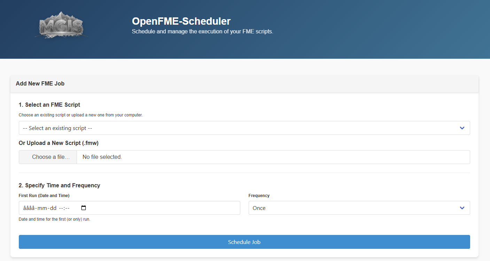

# OpenFME-Scheduler



OpenFME-Scheduler is an open-source application designed to manage and schedule the execution of FME scripts. It provides a user-friendly interface and robust backend to automate workflows using `.fmw` scripts.

## Prerequisites

- **Node.js** (version 16 or higher recommended)
- **npm** (comes with Node.js)
- **FME Desktop** installed and `fme.exe` available in your system PATH

## Features

- **FME Script Management**
  - Upload and manage `.fmw` scripts.
  - Select scripts from an existing list or upload new ones.

- **Task Scheduling**
  - Schedule scripts to run once, daily, weekly, or monthly.
  - Uses `node-cron` for reliable task scheduling.

- **User Interface**
  - Web-based interface for managing scheduled jobs.
  - View and manage logs directly from the browser.

- **Logging and Monitoring**
  - Logs all events and errors for easy debugging.
  - Provides a log viewer in the web interface.

- **REST API**
  - Exposes endpoints for managing scripts, jobs, and logs.

---

## Installation

### 1. Install Node.js on Windows

Node.js is required to run this application. The installation process on Windows is simple and user-friendly:

1. Go to the official Node.js website: [https://nodejs.org/](https://nodejs.org/)
2. Download the recommended installer for Windows (LTS version).
3. Run the installer and follow the steps in the setup wizard. For most users, the default options are fine.
4. When finished, Node.js and npm (Node.js package manager) will be ready to use.

To verify the installation, open a terminal (PowerShell or CMD) and run:

```sh
node -v
npm -v
```

You should see the version numbers for Node.js and npm.

For more details, see the official guide: [Node.js Windows Installation Guide](https://nodejs.org/en/download/package-manager/#windows)

---

### 2. Clone the repository

```bash
git clone https://github.com/MundoGIS/OpenFME-Scheduler.git
cd OpenFME-Scheduler
```

### 3. Install dependencies

```bash
npm install
```

### 4. Start the application

```bash
node server.js
```

### 5. Open your browser and go to:

```
http://localhost:3100
```

---

## Running as a Windows Service

To install the application as a Windows service:

```sh
node service.js
```

To uninstall the Windows service:

```sh
node uninstall.js
```

## Configuring the OpenFME-Scheduler as a Windows Service

When installing the OpenFME-Scheduler as a Windows Service, it is important to configure the service to run under an appropriate user account. This ensures that the service has the necessary permissions to execute FME workspaces and access required resources.

### Steps to Configure the Service
1. **Install the Service**:
   - Run the `service.js` script to install the service:
     ```bash
     node service.js
     ```

2. **Set the Service to Use a Specific User Account**:
   - Open the Windows Services Manager (`services.msc`).
   - Locate the `OpenFME-Scheduler` service.
   - Right-click the service and select **Properties**.
   - Go to the **Log On** tab.
   - Select **This account** and provide the credentials of a user account with administrative privileges.

3. **Restart the Service**:
   - After setting the account, restart the service to apply the changes.

### Notes for Windows Server Installations
- On Windows Server, it is recommended to use a dedicated service account with the necessary permissions to:
  - Execute `fme.exe`.
  - Access the FME workspaces and any external resources (e.g., databases, files).
- Ensure the service account has a strong password and follows your organization's security policies.

By following these steps, you can ensure that the OpenFME-Scheduler runs reliably in your environment.

---

### Configuring the .env File

Before installing the OpenFME-Scheduler, you must configure the `.env` file to ensure all paths and settings are correct for your environment.

1. **Open the `.env` File**:
   - Locate the `.env` file in the root of the project.
   - Open it in a text editor of your choice.

2. **Update the Paths**:
   - Ensure the paths to `FME_EXECUTABLE_PATH`, `FME_SCRIPTS_PATH`, and `JOBS_FILE_PATH` are correct for your system. For example:
     ```env
     FME_EXECUTABLE_PATH=C:\Program Files\FME\fme.exe
     FME_SCRIPTS_PATH=C:\OpenFME-Scheduler\fme_scripts
     JOBS_FILE_PATH=C:\OpenFME-Scheduler\data\jobs.json
     ```

3. **Save the File**:
   - After making the changes, save the file.

4. **Proceed with Installation**:
   - Once the `.env` file is configured, you can proceed to install the service by running:
     ```bash
     node service.js
     ```

By ensuring the `.env` file is properly configured, you can avoid issues related to incorrect paths or missing configurations.

---

## Usage

- **Add a Job:**
  - Select or upload an FME script.
  - Specify the schedule (date, time, and frequency).

- **View Scheduled Jobs:**
  - Check the list of all scheduled jobs.
  - Remove or modify jobs as needed.

- **View Logs:**
  - Use the log viewer to monitor execution logs.

---

## Notes

- Make sure `fme.exe` is available in your system PATH or update the path in `server.js`.
- The application is designed for Windows environments.

---

## License

This project is licensed under the Mozilla Public License, v. 2.0. See the [LICENSE](LICENSE) file for details.

---

## Contact

Developed by MundoGIS for the OpenFME-Scheduler project.
For inquiries, contact: abel.gonzalez@mundogis.se